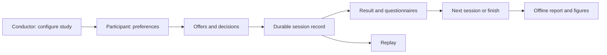

# NEGOTIATOR: A Comprehensive Framework for Human-Agent Negotiation Integrating Preferences, Interaction, and Emotion

[](https://doi.org/10.5281/zenodo.22728983)

**Set up, run and review human–agent negotiation studies from a local browser.**

[](https://github.com/monurkeskin/NEGOTIATOR/actions/workflows/tests.yml)
[](https://doi.org/10.24963/ijcai.2024/1012)
[](LICENSE)

NEGOTIATOR brings experiment configuration, preference elicitation, negotiation
strategies, participant interaction and session analysis into one workspace. Start
with text or a browser avatar; connect a lab robot through a separate device bridge
when your setup is ready. The default workflow runs locally without an account,
API key, camera, robot or external service.

**Maintained release 2.0.0** · [Reproducibility](REPRODUCIBILITY.md) · [Paper map](paper-map.json)

[Start a study](docs/studies.md) · [Participant guide](docs/participant.md) ·
[Analysis](docs/analysis.md) · [Devices](docs/devices.md) ·
[Develop an agent](docs/development.md) · [Paper companions](docs/papers.md)


## Your first negotiation

Install Python 3.11 or newer. In a terminal, create an isolated environment:

```bash
python3 -m venv .venv
source .venv/bin/activate
python -m pip install https://github.com/monurkeskin/NEGOTIATOR/releases/download/v2.0.0/negotiator_human-2.0.0-py3-none-any.whl
negotiator gui
```

On Windows, use `py -3 -m venv .venv`, then `.venv\Scripts\Activate.ps1` in
PowerShell. The browser application is included in the wheel; Node is only needed
for frontend development. [Other installation options and troubleshooting](docs/installation.md).

1. Choose **New study**, then a domain, preferences and one or more session conditions.
2. Open **Open participant view** on the participant's screen. Complete the preference
   ranking if selected, then use **Start session** in the conductor workspace.
3. Propose an offer, edit text input, accept the partner's current offer or withdraw.
   After the session, follow the configured questionnaire and break sequence.
4. Select **Build report**, then **Open report** or **Download all files (ZIP)**.

The two views run on the same computer, including a second monitor. The server
binds to loopback; this release is not an Internet-hosted study service. Start with
a synthetic practice run before configuring participant data.



## Choose your path

| Goal | Start here |
| --- | --- |
| First negotiation study | [GUI walkthrough](docs/studies.md) and [participant view](docs/participant.md) |
| Inspect a published method | [Paper companions](docs/papers.md), [method ledger](docs/methods.md) and [recomputation](docs/reproduction.md) |
| Develop a contribution | [Small agent example](examples/custom_agent.py), [reusable contracts](docs/development.md) and [process adapters](docs/devices.md) |

## What is included?

| Need | Available workflow |
| --- | --- |
| One or several sessions | Practice blocks, counterbalancing, timed breaks, purpose/asset preflight, condition order, participant/cohort IDs, per-session domain, profile, strategy, deadline and presentation |
| Preferences | Assigned profiles or keyboard/drag rank elicitation; full-precision additive utility; XML/JSON import |
| Negotiation | `hybrid`, `solver-2021`, `solver-2025`, `tsbt`, `babt`; public CBOM opponent model |
| Input | Structured bids, corpus-based text interpretation, editable drafts; optional local speech bridge |
| Presentation | Text and browser avatar; separate NAO/Pepper and QT legacy bridges |
| Observations | Explicit self-report and optional frozen FaceChannel adapter; source, quality and missingness recorded |
| Experiment records | Hash-linked JSONL, immutable configuration, exactly identified offers, distinct terminal reasons, notes and surveys |
| Analysis | Session trajectories, utility space, descriptive participant/condition summaries, missing pairs, model error and presentation receipts |
| Recompute and cite | Hashed data-only recipes, separate calculation/reference comparison, participant bootstrap examples and executed-component citations |
| Export | Standalone HTML, CSV, Excel, PNG/SVG/PDF and source snapshots; no raw recording by default |

Holiday A, Holiday B, Fruits and Desert Island are bundled. Allocation bids always
state what the human keeps, with each item's total handled independently. Discrete
outcome enumeration is explicitly limited to 50,000 outcomes.

<details>
<summary>See the conductor workspace</summary>


</details>

## Try the complete workflow without a participant

From a source checkout with its environment installed:

```bash
negotiator run examples/study.json --synthetic --output demo-output
negotiator report demo-output --output demo-report
negotiator reproduce examples/reproduction/method.json --output method-output
negotiator cite demo-output --format bibtex
```

Open `demo-report/index.html`. This runs two short simulated interactions and
exports a report. It exercises software behavior; its scores and synthetic survey
answers are **not human-study findings**. The smaller `negotiator demo` command
prints one journal path; `negotiator replay PATH/TO/events.jsonl` reads it back.

## Research scope and validation

This is a **maintained implementation** of the IJCAI framework and selected published
components. The [method ledger](docs/methods.md) explains source pins, equations,
initialization and corrections. The [paper companions](docs/papers.md) provide
study-specific configurations and citations without copying this framework.

Browser journeys and Python regressions cover session isolation, preference ranking,
deadlines, interrupted writes, replay, role restrictions, adapter contracts and
report consistency. CI checks Windows, macOS and Linux. The domain, lifecycle and
policy/model groups each have a 90% **branch** coverage gate. Hardware/model inference
needs the separate [lab validation](docs/lab-validation.md); a synthetic test or
successful preflight does not establish physical robot compatibility.

Historical experiment commits, some questionnaire wording and older gesture/avatar
assets are unresolved. This release does not claim exact reproduction of those
human studies. Device SDK acknowledgements, browser visibility and participant
perception are recorded or interpreted separately.

## Extend and contribute

Domain objects, policies, application services, journals and adapters have separate
responsibilities. Implement the small `Agent` protocol to try a strategy; the
[worked example](examples/custom_agent.py) receives only its own preferences and
committed observations. Follow [development](docs/development.md) and
[CONTRIBUTING](CONTRIBUTING.md) for the test-first workflow, module map and checks.
Report a reproducible issue with a **synthetic** fixture, your version and OS.

## Cite the framework

If NEGOTIATOR supports your research, cite the framework paper. Also cite the
specific strategy/opponent-model paper when studying that method; the companion
repositories include their own citation files.

```bibtex
@inproceedings{keskin2024negotiator,
  title = {NEGOTIATOR: A Comprehensive Framework for Human-Agent Negotiation Integrating Preferences, Interaction, and Emotion},
  author = {Keskin, Mehmet Onur and Buzcu, Berk and Koçyiğit, Berkecan and Çakan, Umut and Doğru, Anıl and Aydoğan, Reyhan},
  booktitle = {Proceedings of the Thirty-Third International Joint Conference on Artificial Intelligence},
  year = {2024},
  doi = {10.24963/ijcai.2024/1012}
}
```

Use [CITATION.cff](CITATION.cff) for citation-manager import. Include the software
version and your configuration in the methods of a new study. GPL-3.0-only;
[NOTICE](NOTICE), [source hashes](provenance.json) and upstream notices preserve
attribution to the original framework, strategies and public CBOM/NegoLog components.
