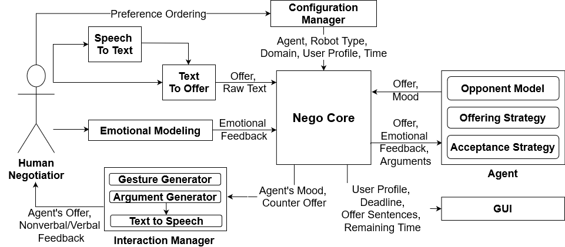
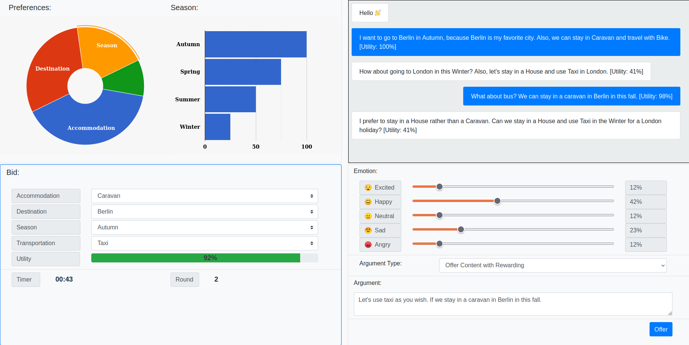
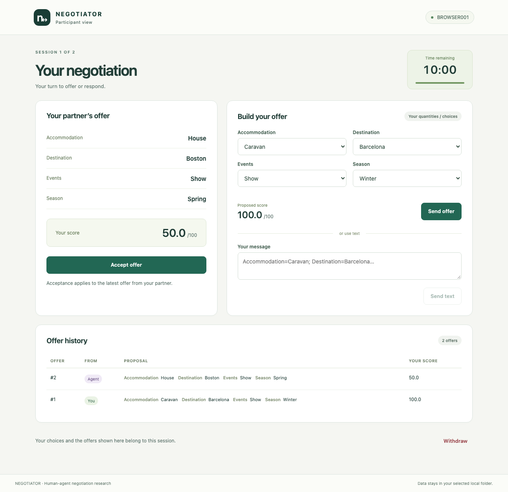
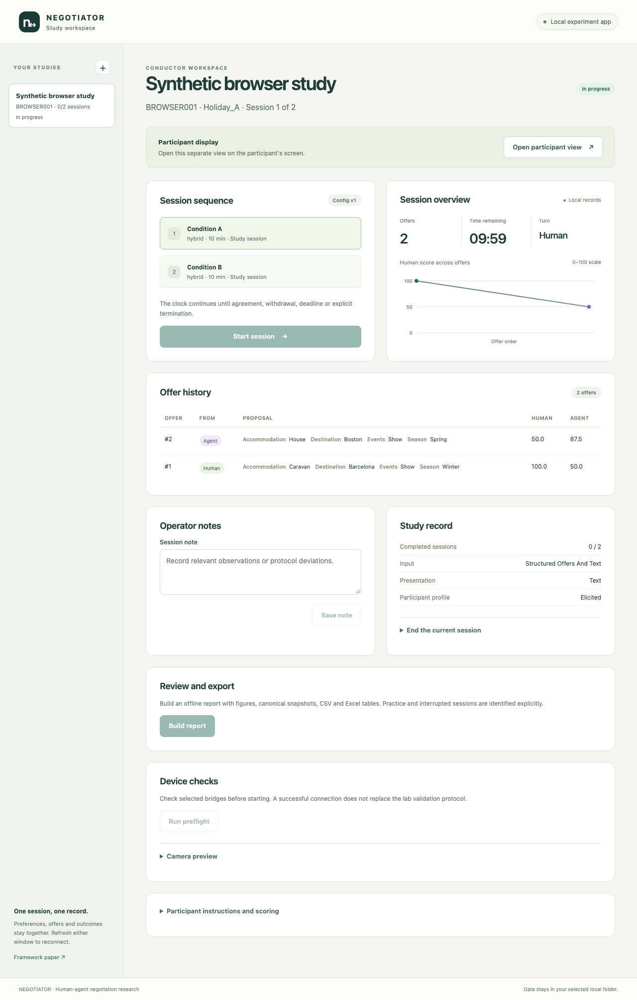

# NEGOTIATOR: A Comprehensive Framework for Human-Agent Negotiation Integrating Preferences, Interaction, and Emotion — [IJCAI 2024]

Mehmet Onur Keskin · Berk Buzcu · Berkecan Koçyiğit · Umut Çakan · Anıl Doğru · Reyhan Aydoğan

[Paper](https://doi.org/10.24963/ijcai.2024/1012) · [First negotiation](#your-first-negotiation) · [Study guide](docs/studies.md) · [Research companions](#a-family-of-negotiation-studies) · [Citation](#cite-the-framework)

[](https://github.com/monurkeskin/NEGOTIATOR-IJCAI-2024/actions/workflows/tests.yml)
[](LICENSE)

Negotiating with a person involves more than selecting a bid. A system must
understand the proposed agreement, reason about preferences, decide how to
respond and communicate that response. **NEGOTIATOR brings these parts into a
shared framework for human–agent and human–robot negotiation research.**

## The framework in the paper



*Figure 1 from the IJCAI 2024 paper. Nego Core coordinates the interaction;
offering strategy, acceptance strategy and opponent model sit within the agent.
The interaction manager turns its offer and mood into a response.*

The central idea is to make study components replaceable. A researcher can
change the bidding strategy while keeping the interface, or compare embodiments
while keeping the negotiation task common. Table 1 describes the design space:

| Configuration dimension | Options described in the paper |
| --- | --- |
| User input | Speech; text; audio and visual input |
| Interaction | GUI only; robot only; robot with GUI |
| Agent | Emotion-aware; combined behavior/time; behavior-based |
| Emotion representation | Categorical; dimensional; personalized |
| Negotiation task | Zero-sum and non-zero-sum scenarios |

*Readable transcription of Table 1. This is the paper's configuration matrix.
The [current component guide](docs/methods.md) and [device guide](docs/devices.md)
describe the components available in this maintained release and their setup.*

## One architecture, different interactions

| GUI-only negotiation | Robot and GUI |
| --- | --- |
|  |  |

*Figure 2 from the paper: two interfaces built around the same negotiation
workflow. These are the original demonstration screens and robot setup.*

The paper connects the framework to studies of Jennifer's gestures, Solver's
emotional feedback, physical versus virtual embodiment, and robot appearance.
The [paper companions below](#a-family-of-negotiation-studies) let you follow
each question through its own protocol, profiles and method checks.

This repository continues that work with a local browser application, separate
conductor and participant views, durable session records and device bridges.
The original paper describes a Docker/RabbitMQ architecture; the maintained
engine uses its documented local application and process contracts. You can
try a complete negotiation before configuring a robot.
[Paper figures and sources](docs/paper/README.md).

## Your first negotiation

Use Python 3.11 or newer. The default workflow needs no account, API key, camera
or robot. The browser application is included in the wheel.

```bash
python3 -m venv .venv
source .venv/bin/activate
python -m pip install https://github.com/monurkeskin/NEGOTIATOR-IJCAI-2024/releases/download/v2.0.0/negotiator_human-2.0.0-py3-none-any.whl
negotiator gui
```

On Windows, use `py -3 -m venv .venv` and `.venv\Scripts\Activate.ps1`
in PowerShell. [Other installation options](docs/installation.md).

1. Choose **New study**, then a domain, preferences and session conditions.
2. Use **Open participant view** on the participant's screen and **Start session**
   in the conductor workspace.
3. Make offers, inspect the partner's response and reach an agreement or end the session.
4. Choose **Build report**, then **Open report** to inspect the interaction.



*The maintained browser interface; a synthetic session.*

The two views run on the same computer, including a second monitor. Start with a
synthetic practice run; the default server is a local workspace.

<details>
<summary>See the conductor workspace</summary>



</details>

## What can you study?

| Question | Tools in this release | Guide |
| --- | --- | --- |
| How do bargaining tactics differ? | Hybrid, Solver, TSBT and BABT presets; a public CBOM opponent model | [Methods](docs/methods.md) |
| How do preferences shape offers? | Assigned/ranked profiles, resource-allocation and categorical domains | [Study setup](docs/studies.md) |
| How does an interaction unfold? | Separate views, practice/main sessions, breaks, surveys and counterbalancing | [Participant workflow](docs/participant.md) |
| How are offers presented? | Text, browser avatar and independent NAO/Pepper/QT bridges | [Devices](docs/devices.md) |
| What happened in a session? | Bid histories, utility trajectories, event replay and report exports | [Analysis](docs/analysis.md) |
| How can I add a component? | Small agent interface, synthetic fixtures and reusable contract tests | [Development](docs/development.md) |

Holiday A/B, Fruits and Desert Island are bundled. Allocation bids state what the
human keeps. The current enumerating strategies support up to 50,000 outcomes.

## A family of negotiation studies

Each paper companion explains its research question, method and protocol, then
provides configurations and checks that use a pinned version of this framework.
The studies share infrastructure; their experimental conditions and findings remain distinct.

| Paper companion | Venue |
| --- | --- |
| [Solver Agent: Towards Emotional and Opponent-Aware Agent for Human-Robot Negotiation](https://github.com/monurkeskin/Solver-Agent-AAMAS-2021) | AAMAS 2021 |
| [Let's Negotiate with Jennifer! Towards a Speech-Based Human-Robot Negotiation](https://github.com/monurkeskin/Lets-Negotiate-with-Jennifer-ACAN-2018) | ACAN 2018 · book chapter 2021 |
| [Would You Imagine Yourself Negotiating With a Robot, Jennifer? Why Not?](https://github.com/monurkeskin/Jennifer-Why-Not-THMS-2022) | IEEE THMS 2022 |
| [Effects of Agent's Embodiment in Human-Agent Negotiations](https://github.com/monurkeskin/Effects-of-Agents-Embodiment-IVA-2023) | IVA 2023 |
| [You Look Nice, but I Am Here to Negotiate: The Influence of Robot Appearance on Negotiation Dynamics](https://github.com/monurkeskin/You-Look-Nice-but-I-Am-Here-to-Negotiate-HRI-2024) | HRI 2024 |
| [An Adaptive Emotion-Aware Strategy for Human-Agent Negotiation: Insights from Real-World Human-Robot Experiments](https://github.com/monurkeskin/An-Adaptive-Emotion-Aware-Strategy-IVA-2025) | IVA 2025 |

[How the studies relate](docs/papers.md).

## Explore an entire recorded workflow

From a source checkout with its environment installed:

```bash
negotiator run examples/study.json --synthetic --output demo-output
negotiator report demo-output --output demo-report
negotiator reproduce examples/reproduction/method.json --output method-output
negotiator cite demo-output --format bibtex
```

Open `demo-report/index.html` for a report of two short synthetic interactions.
These runs demonstrate the tools and calculations. Published participant findings
are described in the corresponding papers, and their data access conditions remain
separate from using this open-source software. [Reproducibility](REPRODUCIBILITY.md).

## Contribute a study or a component

Start with [the small agent example](examples/custom_agent.py), add a synthetic test
for the behavior you want, and follow [the development guide](docs/development.md).
Domain objects, strategies, study services, event records and adapters have separate
responsibilities. A contribution should explain the method it implements and how
its change affects recorded outcomes.

Software tests cover session isolation, deadlines, preference conversion, replay,
write failures and adapter contracts on Windows, macOS and Linux. Device tests
establish transport behavior; physical robot and camera/model validation requires
the [lab checks](docs/lab-validation.md). [Contributing](CONTRIBUTING.md).

## Cite the framework

If NEGOTIATOR supports your research, please cite the framework paper:

```bibtex
@inproceedings{keskin2024negotiator,
  title = {NEGOTIATOR: A Comprehensive Framework for Human-Agent Negotiation Integrating Preferences, Interaction, and Emotion},
  author = {Keskin, Mehmet Onur and Buzcu, Berk and Koçyiğit, Berkecan and Çakan, Umut and Doğru, Anıl and Aydoğan, Reyhan},
  year = {2024},
  doi = {10.24963/ijcai.2024/1012},
  booktitle = {Thirty-Third International Joint Conference on Artificial Intelligence}
}
```

Also cite the specific strategy or opponent-model paper when studying that method.
[CITATION.cff](CITATION.cff) supports citation managers;
the [software artifact](https://doi.org/10.5281/zenodo.22728983) identifies release 2.0.0.
GPL-3.0-only. [NOTICE](NOTICE), [licenses](licenses/) and
[provenance](provenance.json) preserve the original contributors and sources.
