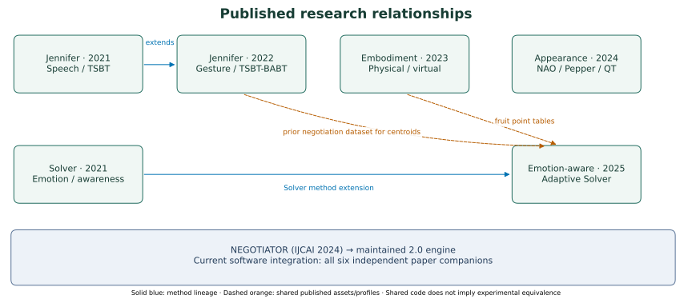

# Paper companions

The framework paper is [NEGOTIATOR (IJCAI 2024)](https://doi.org/10.24963/ijcai.2024/1012).
The following independent repositories pin this framework and provide paper-specific
configurations, citations, method notes and a complete synthetic run/report command.

| Paper | Companion | Principal preset |
| --- | --- | --- |
| [Let's Negotiate with Jennifer! Towards a Speech-Based Human-Robot Negotiation](https://doi.org/10.1007/978-981-15-5869-6_1) | [`jennifer-negotiation-2021`](https://github.com/monurkeskin/Lets-Negotiate-with-Jennifer-ACAN-2018) | `tsbt` |
| [Solver Agent: Towards Emotional and Opponent-Aware Agent for Human-Robot Negotiation](https://www.ifaamas.org/Proceedings/aamas2021/pdfs/p1557.pdf) | [`solver-agent-2021`](https://github.com/monurkeskin/Solver-Agent-AAMAS-2021) | `solver-2021` |
| [Would You Imagine Yourself Negotiating With a Robot, Jennifer? Why Not?](https://doi.org/10.1109/THMS.2021.3121664) | [`jennifer-negotiation-2022`](https://github.com/monurkeskin/Jennifer-Why-Not-THMS-2022) | `tsbt` |
| [Effects of Agent's Embodiment in Human-Agent Negotiations](https://doi.org/10.1145/3570945.3607362) | [`agent-embodiment-2023`](https://github.com/monurkeskin/Effects-of-Agents-Embodiment-IVA-2023) | `hybrid` |
| [You Look Nice, but I Am Here to Negotiate: The Influence of Robot Appearance on Negotiation Dynamics](https://doi.org/10.1145/3610978.3640759) | [`robot-appearance-2024`](https://github.com/monurkeskin/You-Look-Nice-but-I-Am-Here-to-Negotiate-HRI-2024) | `solver-2021` |
| [An Adaptive Emotion-Aware Strategy for Human-Agent Negotiation: Insights from Real-World Human-Robot Experiments](https://doi.org/10.1145/3717511.3747087) | [`emotion-aware-negotiation-2025`](https://github.com/monurkeskin/An-Adaptive-Emotion-Aware-Strategy-IVA-2025) | `solver-2025` |

Jennifer 2022 also includes BABT and separate tactic groups; emotion-aware 2025
includes Hybrid as its comparator. Embodiment uses Hybrid, while Appearance uses
Solver. Their configurations preserve these distinctions.

Install a companion independently using its requirements file. It contains no
second framework copy and does not require this checkout next to it. Its exact
framework revision is recorded in framework.json. Follow the companion's METHOD
and CONFIGURATIONS guides before a lab study: some historical assets, gestures,
questionnaires and experiment identities remain unresolved. Synthetic practice
and generated interactions are visibly labeled; they are not human-study results.

The public [CBOM](https://github.com/monurkeskin/Conflict-Based-Negotiation-Strategy-Appl-Intell-2023) repository separately documents
the opponent-model implementation. [NegoLog V2](https://github.com/monurkeskin/NegoLog-IJCAI-2024)
serves automated agent tournaments; this framework's studies and reports are built
around participants and individual sessions. Cite each component you actually use.

## Relationships across the series

The graphic's [data and sources](paper-relations.json) are versioned, and
`scripts/render_relationships.py` regenerates SVG/PDF/PNG views. Publication year is
shown; the Jennifer book chapter's presentation/online dates precede its 2021 volume.
A shared method, point table or centroid asset does not imply the same participants,
protocol, robot embodiment or empirical outcome. Appearance's two cohorts are also
kept distinct within its own companion.

NEGOTIATOR is the common maintained runtime. Each companion retains its paper's
protocol, method choices, input manifest, independent oracles, reproduction targets
and citation. Shared fixes go into the engine; paper-specific conditions and
historical evidence do not become hidden global defaults.
